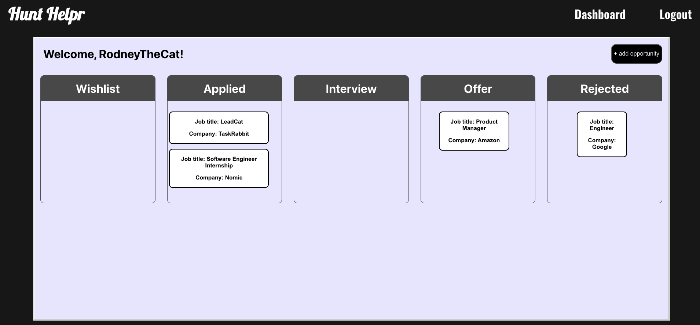
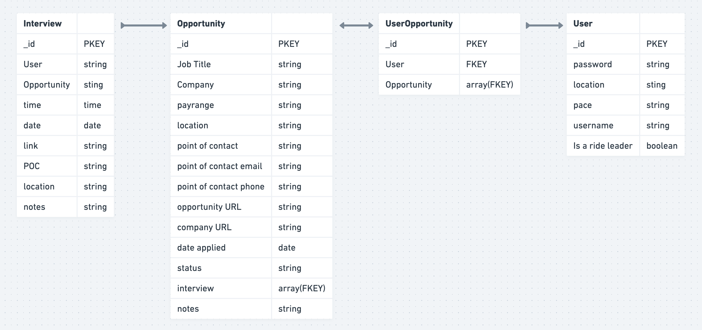

# Job Hunt Helper
## By: Katie Vermazani
[GitHub](https://github.com/moomoomewmew) | [Linkedin](https://www.linkedin.com/in/user02387456/)
***

## Description
This site is a job search managment tool. It keeps track of:
* interview dates
* links to the job posts
* company websites
* state of application: pre-application, applied, interview, accepted, etc.
* point of contact name and contact info

## Preview

## Plans

#### Component Hierarchy

#### ERD

## Stack:
* Postgress
* Express
* React
* Node.js

